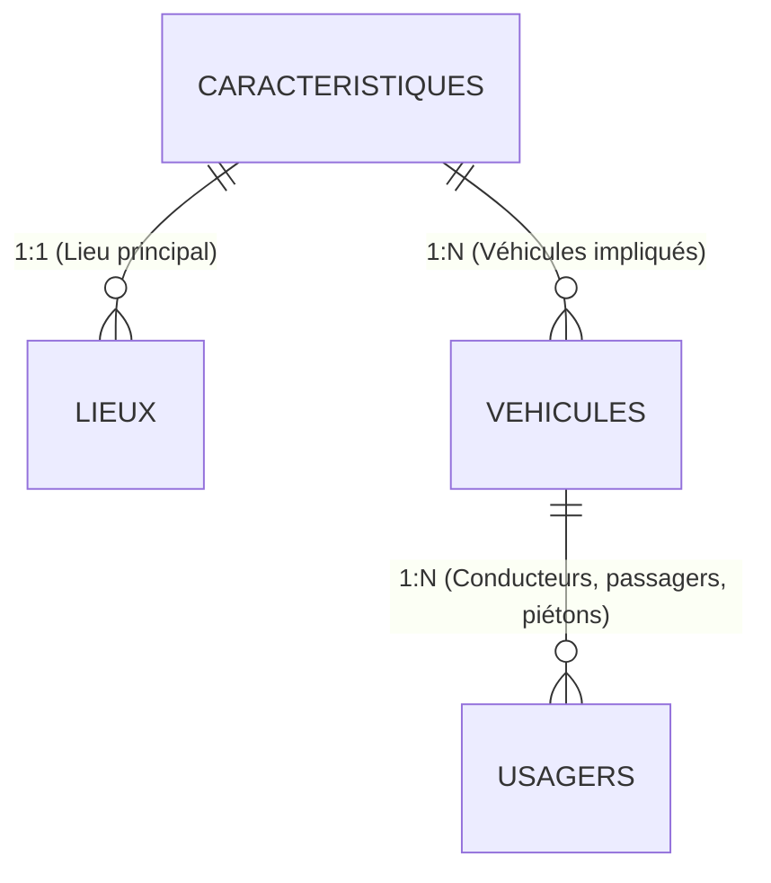

#  Projet Data Science - Analyse et Prédiction de la Gravité des Accidents Routiers (Fichier BAAC 2024)

[](https://www.python.org)
[](https://pandas.pydata.org)
[](https://scikit-learn.org)
[](https://xgboost.readthedocs.io)

Ce projet de Data Science est axé sur la préparation, l'analyse et la modélisation prédictive des données d'accidents corporels de la circulation routière en France en **2024**, issues de la base de données nationale **BAAC** (Bulletin d'Analyse des Accidents Corporels) administrée par l'ONISR (Observatoire National Interministériel de la Sécurité Routière).

L'objectif principal est de **nettoyer et consolider les données**, puis d'**entraîner des modèles de Machine Learning** capables de prédire la gravité d'un accident pour chaque usager impliqué.

---

##  Structure du Projet

Voici l'organisation des fichiers et dossiers du projet :

```text
Projet_BAAC/
├── data/
│   ├── raw/                       # Fichiers sources CSV de l'ONISR (2024)
│   │   ├── Caract_2024.csv        # Circonstances temporelles et météo
│   │   ├── Lieux_2024.csv         # Caractéristiques physiques de la route
│   │   ├── Usagers_2024.csv       # Personnes impliquées (âge, gravité, rôle...)
│   │   └── Vehicules_2024.csv     # Véhicules impliqués
│   └── processed/                 # Fichiers nettoyés et préparés
│       ├── baac_clean.csv         # Base fusionnée complète (56 variables)
│       └── baac_features.csv      # Base allégée optimisée pour le ML (20 variables)
├── notebooks/
│   ├── nettoyage_donnees.ipynb    # Chargement, nettoyage et feature engineering
│   └── machine_learning.ipynb     # Pipeline de modélisation et évaluation
├── images/                        # Graphiques et visualisations générés
│   ├── features_important.png     # Importance des variables par modèle
│   └── matrix_confusion_&_curve_ROC.png # Matrices de confusion & Courbes ROC
├── documentation_BAAC.md          # Synthèse technique officielle des règles BAAC
└── README.md                      # Présentation détaillée du projet (ce fichier)
```

---

## Structure des Données (Relations BAAC)

Le fichier BAAC est découpé en 4 tables annuelles interconnectées par l'identifiant unique d'accident `Num_Acc` :



1. **Caractéristiques** : Circonstances de l'accident (luminosité, conditions atmosphériques, type de collision, département, coordonnées GPS).
2. **Lieux** : Informations sur la route principale (catégorie de route, régime de circulation, état de la surface, vitesse maximale autorisée `vma`).
3. **Véhicules** : Type de véhicule (`catv`), obstacle heurté, type de motorisation, manœuvre avant l'impact.
4. **Usagers** : Profil des victimes (conducteur/passager/piéton, gravité de la blessure, sexe, année de naissance, dispositifs de sécurité utilisés).

---

## 🛠️ Étape 1 : Nettoyage et Préparation des Données

Le notebook [`notebooks/nettoyage_donnees.ipynb`](file:///C:/Users/tiaal/Projet_BAAC/notebooks/nettoyage_donnees.ipynb) automatise l'ensemble du nettoyage du jeu de données 2024 :

* **Nettoyage des identifiants** : Suppression des espaces insérés par l'ONISR dans les champs clés numériques (`Num_Acc`, `id_vehicule`, `id_usager`) afin de permettre des jointures parfaites.
* **Standardisation des valeurs manquantes** : Conversion systématique des valeurs textuelles vides, de `-1`, `-1.0`, `.` ou `None` en véritables `NaN` sous Pandas.
* **Gestion des délits de fuite** : Détection des véhicules enregistrés sans usagers correspondants (24 cas en 2024).
* **Jointure SQL-like** : Fusion au grain le plus fin (l'usager) en utilisant la table `USAGERS` comme table principale, connectée à `VEHICULES` (sur `Num_Acc` et `id_vehicule`), `CARACTERISTIQUES` et `LIEUX`.
* **Feature Engineering** :
  * Calcul de l'**âge** exact de l'usager lors de l'accident (`an` - `an_nais`).
  * Formatage de l'heure au format standard `HH:MM`.
  * Conversion et nettoyage des coordonnées GPS (`lat` & `long` avec séparateurs décimaux).
  * Création de la **variable cible binaire `is_grave`** :
    * **`1`** (Accident Grave) : Usager tué ou blessé hospitalisé (gravités `2` et `3`).
    * **`0`** (Accident Non Grave) : Usager indemne ou blessé léger (gravités `1` et `4`).
  * Binarisation du sexe (`is_male` : `1` pour Homme, `0` pour Femme).

Deux fichiers sont exportés dans `data/processed/` :
* `baac_clean.csv` : Version complète (162 548 lignes, 56 colonnes) destinée aux analyses de Business Intelligence (BI) ou aux cartes interactives.
* `baac_features.csv` : Version filtrée avec les 20 variables critiques pour les modèles de prédiction.

---

##  Étape 2 : Modélisation Machine Learning

Le notebook [`notebooks/machine_learning.ipynb`](file:///C:/Users/tiaal/Projet_BAAC/notebooks/machine_learning.ipynb) s'occupe de la construction de la classification prédictive :

### 1. Stratégie et Prétraitement
* **Imbalance des classes** : La base présente une distribution déséquilibrée avec seulement **16.92 % d'accidents graves** (classe `1`). Une partition train/test (80/20) avec stratification (`stratify=y`) a été appliquée.
* **Pipeline scikit-learn (`ColumnTransformer`)** :
  * **Variables numériques** (`age`, `is_male`) : Imputation par la médiane.
  * **Variables catégorielles** (`catu`, `catv`, `motor`, `obs`, `obsm`, `lum`, `atm`, `col`, `agg`, `int`, `catr`, `circ`, `surf`, `vma`) : Imputation par la valeur la plus fréquente (mode), puis encodage `OneHotEncoder` avec gestion des valeurs inconnues (génération de 162 variables d'entraînement).

### 2. Modèles Évalués et Résultats
Cinq modèles de classification ont été entraînés et comparés sur l'ensemble de test (32 510 usagers) :

| Modèle | Accuracy globale | Précision (Grave) | Rappel (Grave) | F1-Score (Grave) | Rationale |
| :--- | :---: | :---: | :---: | :---: | :--- |
| **Régression Logistique** | 85% | 61% | 27% | 37% | Baseline linéaire simple, peine sur les relations non-linéaires. |
| **Random Forest** | 85% | 73% | 20% | 31% | Très robuste mais trop conservateur sur la classe minoritaire. |
| **XGBoost** | **86%** | **68%** | **30%** | **42%** | **Meilleur score global F1. Bon compromis précision/rappel.** |
| **CatBoost** | 86% | 69% | 27% | 39% | Excellente gestion native des variables catégorielles. |
| **LightGBM** | 86% | 67% | 29% | 41% | Performance très proche de XGBoost avec un entraînement ultra-rapide. |

### 3. Principaux Enseignements
* Les modèles basés sur le **Gradient Boosting (XGBoost et LightGBM)** surclassent les méthodes traditionnelles sur ce jeu de données complexe et déséquilibré.
* Dans un contexte de sécurité routière, le **rappel** (capacité à détecter un accident grave) est critique. XGBoost obtient le meilleur rappel (30%) tout en maintenant une précision satisfaisante (68%).
* **Facteurs clés influençant la gravité** : L'âge de l'usager, le type de véhicule (EDP/motos vs VL), la vitesse maximale autorisée (`vma`), la luminosité (`lum`), et le type de collision.

---

##  Visualisations Disponibles

Les graphiques d'évaluation des modèles sont enregistrés dans le dossier `images/` :

1. **Importance des Variables** (`images/features_important.png`) :
   Montre les variables ayant le plus de poids dans les prédictions pour chaque modèle d'arbres.
2. **Matrices de Confusion & Courbes ROC** (`images/matrix_confusion_&_curve_ROC.png`) :
   Permettent de comparer graphiquement l'aire sous la courbe (AUC) et la répartition des vrais/faux positifs.

---

## Installation et Utilisation

### Prérequis
Assurez-vous d'avoir Python (>= 3.10) et les dépendances installées. Vous pouvez les installer via pip :

```bash
pip install pandas numpy scikit-learn xgboost catboost lightgbm matplotlib seaborn jinja2
```

### Exécution
1. Placez les fichiers BAAC 2024 bruts (format CSV séparateur `;`) dans le dossier `data/raw/`.
2. Lancez Jupyter Notebook ou JupyterLab :
   ```bash
   jupyter notebook
   ```
3. Exécutez en premier le notebook de nettoyage : `notebooks/nettoyage_donnees.ipynb`.
4. Exécutez ensuite le notebook de modélisation : `notebooks/machine_learning.ipynb`.
